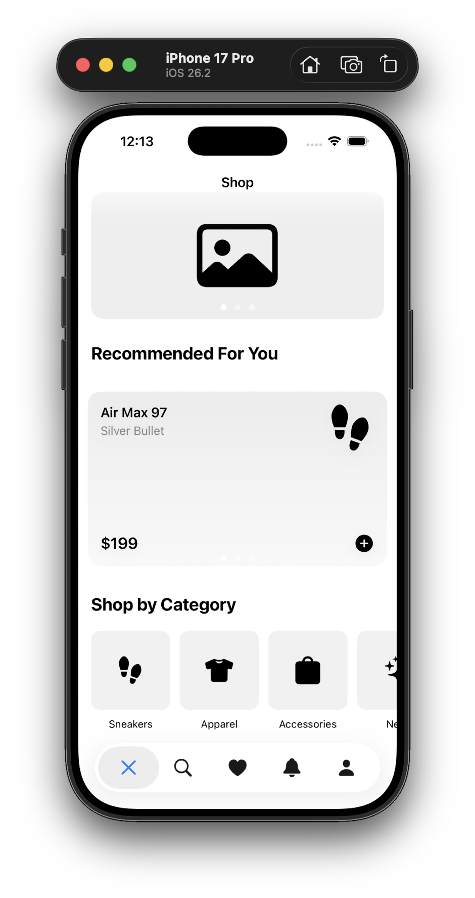

# StockX-Demo

This project is a SwiftUI interface prototype for a sneaker and apparel shopping app, inspired by the design patterns used in the **StockX mobile application**.

The goal of the project was to rapidly prototype a modern shopping interface using SwiftUI and MVVM architecture.

An interesting aspect of this project is that the entire interface was built in about 20 minutes using the coding assistant in Xcode 26.3.

Before building the UI, I first observed and analyzed the **StockX mobile application** layout and then used a structured prompt to generate the initial SwiftUI structure. I then refined the UI and components.

## App Preview

  

# Features

The interface includes several common patterns used in modern e-commerce apps.

## Banner Carousel

- A horizontal banner carousel at the top of the screen  
- Implemented using `TabView` with paging  
- Displays promotional banners  

## Recommended For You

- A product card carousel  
- Horizontally scrollable cards  

Each card displays:

- Product title  
- Subtitle  
- Price  
- Product icon  

Built using reusable `ProductCardView`.

## Shop by Category

- A horizontal scroll of category tiles  
- Each category uses a square card with an icon and title  
- Implemented with `ScrollView(.horizontal)`

## Bottom Navigation Bar

A five-icon navigation bar with:

- Home (X icon)  
- Search  
- Favorites (Heart icon)  
- Alerts (Bell icon)  
- Profile  

# Architecture

The project follows a simple **MVVM structure**.

## Models

- `Banner`
- `Product`
- `CategoryItem`

## ViewModel

`ShopViewModel`

Stores banner data, recommended products, and categories.

## Views

- `ContentView`
- `ShopHomeView`
- `ProductCardView`
- `CategorySquareView`
